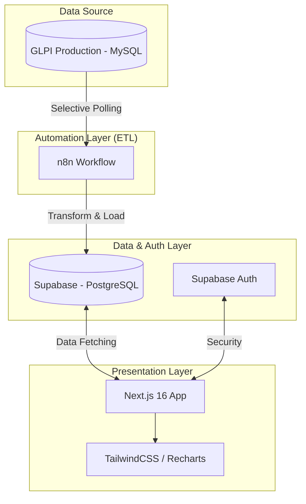

# 📊 GLPI Dashboard - Modern Analytics for IT Service Management

A high-performance, real-time analytics platform for visualizing GLPI Helpdesk data. Built with **Next.js 16**, **Supabase**, and **n8n**, this solution provides IT managers with critical insights, audio/visual alerts for SLA breaches, and a robust project tracking system.

## 🎯 Objective
The primary objective of this project is to provide a central, high-speed visibility layer for GLPI data. It aims to empower IT teams to transition from reactive troubleshooting to proactive service management by providing real-time indicators and predictive alerts.

## ⚠️ The Problem it Solves
Standard GLPI reporting often suffers from:
- **Performance Bottlenecks**: Complex SQL queries on production databases can be slow and impact system stability.
- **Limited Real-time Visibility**: Lack of proactive alerts (audio/visual) for critical SLA thresholds.
- **Siloed Data**: Difficulty in correlating operational tickets with strategic project goals in a single view.
- **Poor UX**: Standard interfaces can be overwhelming and difficult to customize for quick decision-making.

**GLPI Dashboard** solves this by decoupling the data (ETL via n8n) and presenting it through a modern, responsive web interface optimized for speed and clarity.

## 🏗️ Architecture & Methodology

### Methodology: Iterative & Decoupled
The project followed an **Iterative Development** methodology, focusing on vertical slices of functionality:
1.  **Data Extraction (ETL)**: Standardizing GLPI data into a modern schema.
2.  **Infrastructure**: Setting up a serverless, high-performance back-end with Supabase.
3.  **Frontend**: Building a "Wow-factor" UI using React and TailwindCSS.
4.  **Security**: Implementing Role-Based Access Control (RBAC) and Row-Level Security (RLS).

### Technical Architecture
The solution uses a **Modern Decoupled Stack**:

## 🛠️ Technology Stack
- **Frontend**: Next.js 16 (App Router), React 19, TypeScript
- **Styling**: TailwindCSS 4 (Modern, Fluid UI), Lucide Icons
- **State/Auth**: AuthContext (Custom Hook) + Supabase Auth
- **Backend/Database**: Supabase (PostgreSQL, RLS Policies)
- **ETL/Automation**: n8n (Scheduled SQL Workflows)
- **Visualization**: Recharts (Dynamic Charts), custom alerting system (Audio/Visual)

## ✨ Key Features
- **🔐 Secure RBAC**: Full authentication system with Admin/User roles.
- **📉 10+ KPIs**: Total Tickets, SLA Compliance, Satisfaction, Resolution Time, Growth Metrics.
- **🚨 Smart Alerts**: Audio and visual alarms for tickets near SLA breach (2h threshold).
- **📋 Project Board**: Integrated Kanban for departmental projects and task tracking.
- **🔄 Auto-Initialization**: System automatically detects and creates the default 'admin' user on first run.

## ⚙️ Installation & Setup

1.  **Repository Setup**: `git clone https://github.com/your-username/glpi-dashboard.git`
2.  **Environment Variables**: Configure `.env.local` with Supabase credentials.
3.  **Schema Sync**: Execute `database/init.sql` in your Supabase SQL Editor.
4.  **n8n Workflow**: Import the provided JSON workflow and configure the MySQL connection.
5.  **Run**: `npm install && npm run dev`

---
*Developed with Advanced Engineering standards for high-performance IT environments.*
